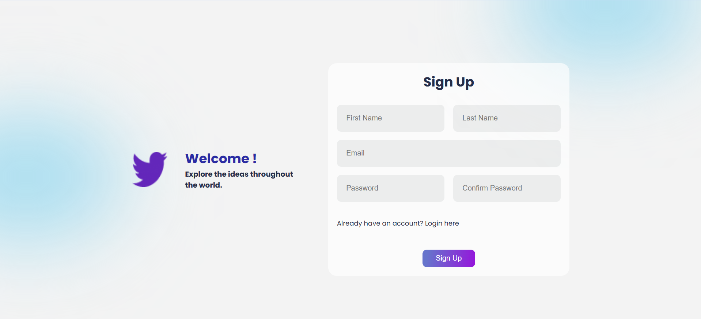

<h3>Yet to deploy</h3>
# Social Media Web App

This project is a full-stack social media web application 🌐 that has been developed using the **MERN stack 🖥️** and **Rest API 🚀**, In this social media platform where you can share posts, like/unlike posts, Follow/Unfollow users and more.

## 🖥️ Technologies :
  
 **Frontend:**
 
- **React Js**
- **Material-Ui**
- **CSS**
- **React-Router-Dom**
- **Redux**

**Backend:**

- **Node JS**
- **Express Js**
- **MongoDB**
- **Rest API**
- **JWT Authentication**

## 🚀 Features :

- SignUp/Register Page.
- Login Page.
- Share New Post.
- Posts Include Text(Caption).
- Like/Unlike Posts.
- Suggested Users.
- Follow/Unfollow Users.
- View No Of Followers/Following Of User.
- View Other Posts By Follow Users And React On That Posts.
- Update/Edit Profile Page User Data.

### **SignUp/Register Page**  :

### **Login Page**  :

Update readme file

### **Home Page :** 
 
Update readme file

### **User Profile Page**  :

#### **What you need to run this application:**

 - Install NodeJs
 - MongoDB or MongoDB Atlas
 - Install Vs Code
 

#### **How to run this application**

- Make sure MongoDB is running on your system or online.
- Clone this repository
- Open command line in the cloned folder,
    - To run frontend type command `npm start` in `/client` folder.
    - To run backend type command `nodemon index.js` in server folder.
    
